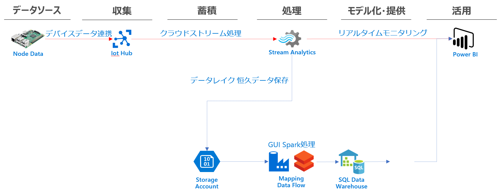

#Rambda Architechtureを作成するARM
##利用方法
[クイック スタート:Azure portal を使用した Azure Resource Manager テンプレートの作成とデプロイ](https://docs.microsoft.com/ja-jp/azure/azure-resource-manager/templates/quickstart-create-templates-use-the-portal)にしたがって、Azure Portalなどからデプロイしてください

##

